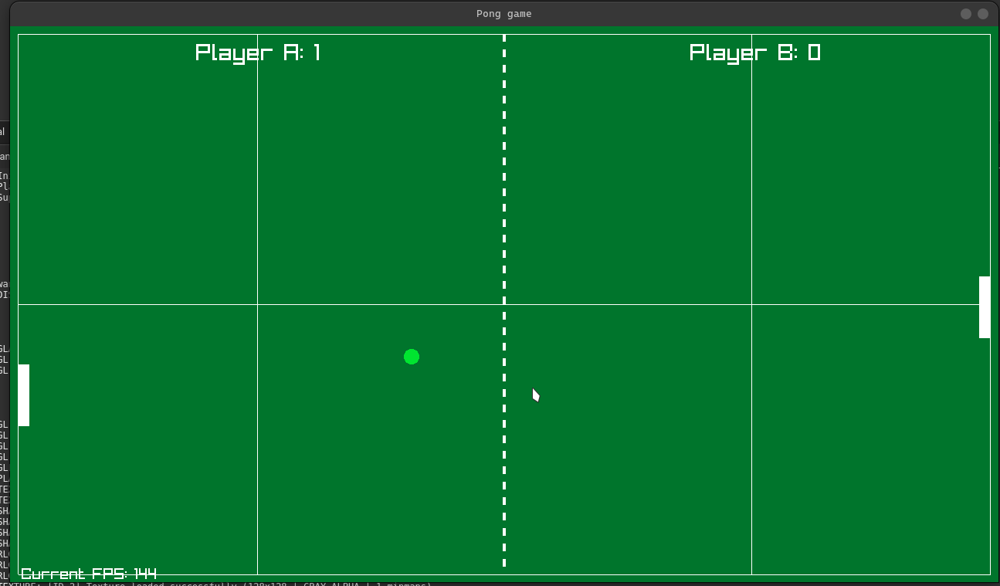

# Pong game 

A small experiment i tried to do after learning c++ a small game using raylib library

it was fun to make and guess what it works !! 

learnt many thing about how to make classes and how constructor works which i was not able to grasp when i learning python idk if i find this c++ quite interesting with all the control in our hand but it was quite fun making this project !! 

Feel free to check out the codes and ping me if you found any improvements that you can do !

# TODO 

- [ ] Add a start and loading screen
- [ ] Add a end screen
- [ ] different balls sort of assets maybe ?!

